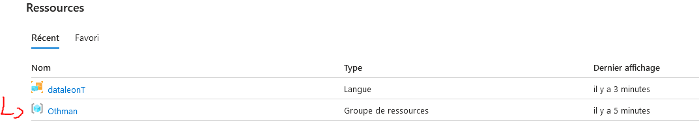
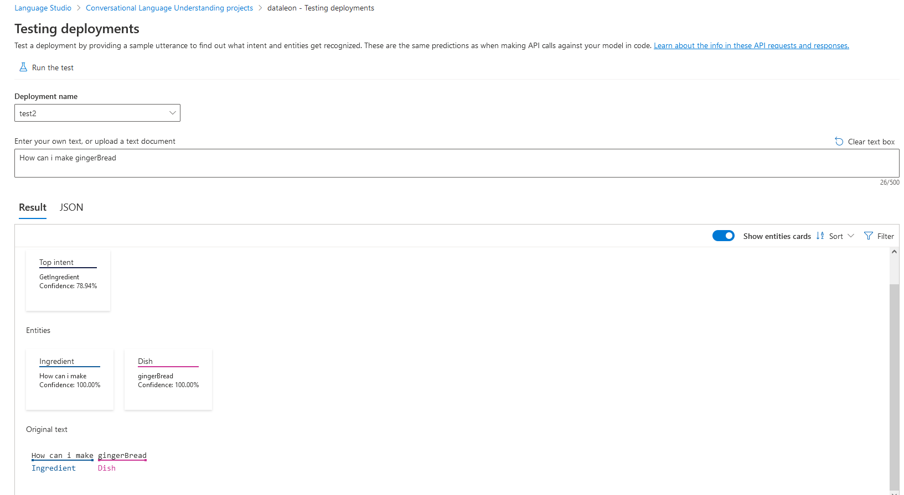

# Hiring-candidate

# DataLeon.ai Testing: Conversational Language Understanding

## Overview
This project aims to create a Python class to retrieve intent from the Machine Learning "Conversational Language Understanding" engine and write pytest cases to test different intents related to recipe cooking.

## Company Website
Learn more about our company at [dataleon.ai](https://dataleon.ai).

## Project Description
The project focuses on testing the functionality of the Conversational Language Understanding engine for recipe-related intents.

## Getting Started
### Prerequisites
- An Azure account
- Python installed on your system

### Installation
1. Sign up for an account on Azure and obtain the API Key.
2. Clone this repository.
3. Install the required dependencies using `pip install -r requirements.txt`.
4. You need to set the api key in the .env file. 

# Step by Step:

## First

To get the access to the API key when you register, you need to go to the resource created (I chose the North EU region), then select the type of resource created. For the project, we used the language type (in Azure Studio) because we needed it to create a project of type CLU (Conversational Language Understanding).




So basically now you get acces to the API key to make API calls with the Python scripts


## Language Studio

So now we get the API key we go to the created project we did on purpose for the training of our model ,data Labeling, Schema definition 

don't forget to choose the correct subscription for the project !

1. For the Schema definition i create two Intents,Intents are tasks or actions the user wants to perform:
    - GetRecipe
    - GetIngredient
    - 

   and three Entities ,Entities are terms relevant to the user's intent and can be extracted to help fulfill the user’s intent:
   - Dish
   - Ingredient
   - Recipe
   - 

2. Now we create Data Labeling ,i did 15 utterances for the GetRecipe intents and for the Getingredient intents , that's our Training set

    - the utterances can be create with a JSON who support the file format or manually

    

3. After we create our Data labelling we can do a training jobs , in order to create a training jobs you need to chose :

    - a name
    - a training mode ( i chose the free one)
    - a data spliting ( i did 75% for the training and 25 % for testing)

    
    

4. Now we close to deploy our model , but before we do that, we can see the performance of our model performance :

    - for mine , is not the best because i did some unclear distincition between intents in training set , and didn't give many labels for the training set , but we can see a score of 71%

    

5. finally we can deploying our model , we chose a model name and deploy , in order to do after some test,with our Python scripts we need the ENDPOINT , to get the endpoint u need to go to the get prediction URL of our deplpying model then take it and place it to the the script
    
    
    

Now we can test our deploying models:
    


## Python Scripts

So now we hava our model we need to interact to make some test 

1. First of all we create a `CLUService`class,  is the main class to interact to the API we got:

     - ```__init__(self, api_key : str, endpoint : str) :``` This function initializes an instance of CLUService taking an API key and the endpoint URL for the CLU resource as arguments. It allows instantiating a CLUService object with the necessary information to interact with the CLU API.

     - ``` get_intent(self, query : str) :``` This function takes a query as input and returns the top intent predicted by the CLU model for that query. It utilizes the API key and endpoint URL to send an HTTP request to the CLU API, then processes the response to extract the top intent.

    - ```_prepare_request_data(self, id : str, query : str) :``` This function prepares the data needed to make a request to the CLU API. It takes a unique identifier for the conversation participant and a query as arguments, and returns a dictionary containing the request data formatted according to the CLU API specifications.

    -```_process_response(self, response : requests.Response) :``` This function processes the response returned by the CLU API after making a request. It extracts the top intent predicted from the response and returns it. If the response does not contain the necessary information, it prints an error message.

    - These functions are crucial for using the CLUService class and enable efficient interaction with the CLU API for predicting intents from provided queries

2. This repository contains automated tests for the `CLUService class`, which interacts with the Azure CLU API to predict intents based on user queries.

### Environment Setup

Ensure you have the necessary environment variables set up in a .env file. This file should contain your API key for accessing the CLU service. An example of the .env file:

- ``` API_KEY=your_api_key_here```

### Running the Tests

To run the tests, you need to have Python and pytest installed. If not installed, you can install pytest using pip:

- `pip install pytest`

Once pytest is installed, you can execute the tests by running the following command in your terminal from the project root directory:

- `python -m pytest test.py`

### Description of Tests

The tests in test.py file validate the functionality of the CLUService class by testing its get_intent method. Each test case simulates a user query and verifies that the correct intent is predicted by the CLU model. Here's a brief description of the test cases:

- `test_get_recipe`: Tests if the CLUService correctly predicts the intent to get a recipe based on a user query.
- `test_get_ingredients`: Tests if the CLUService correctly predicts the intent to get ingredients based on a user query.
- `test_get_recipe2`, test_get_ingredients2, ... : Additional test cases for different queries and intents.

These tests ensure that the CLUService class functions as expected and accurately predicts intents for various user queries.


